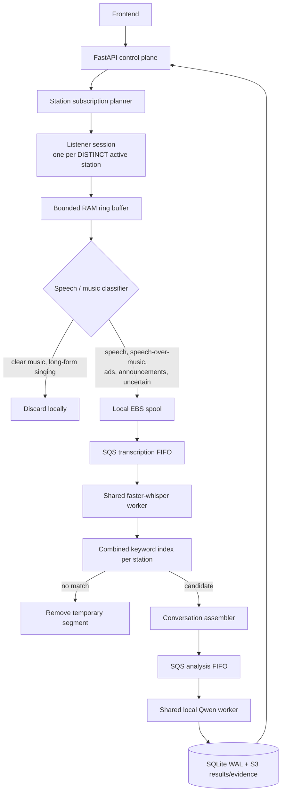

# Radio Broadcast Analysis

A self-hosted radio intelligence backend. It listens to live radio, throws away
music, transcribes speech with a multilingual model, matches campaign keywords
across languages, analyses each mention with a local LLM, and serves the result
through a FastAPI service that a web dashboard consumes.

Everything runs on one EC2 instance. No external AI API is ever called.

## The one pipeline

There is exactly one production processing architecture: **shared station +
SQS**. One connection per *distinct* station, whatever the campaign count.



The queues carry **metadata and references only** — never audio bytes. Audio
lives on the local EBS spool while it is being worked on; durable results,
evidence clips and backups go to S3.

### What makes it economical

| Invariant | Why it matters |
|---|---|
| One listener per **distinct** station | 100 campaigns watching one station is one decode, not 100 |
| Never one listener per campaign | Campaign count stops driving CPU |
| Never one worker per keyword | 10,000 keywords is one scan, not 10,000 |
| Each segment transcribed **once** | ASR is the expensive step; paying twice halves capacity |
| One combined keyword index per station | Built once per station and version, not per campaign |
| One conversation analysed **once** | The LLM runs once and its answer fans out |
| One mention maps to **many** campaigns and keywords | Attribution survives de-duplication |
| Qwen runs only **after** a keyword is confirmed | The model never sees audio nobody asked about |
| Every SQS consumer is idempotent | Redelivery is normal, not an incident |

## Capacity: four different numbers

Conflating these is the easiest way to misread this system.

| Number | Value | What it is |
|---|---|---|
| Catalogue stations | 1,000+ | Rows you can browse and search |
| **Requested** unique stations | 1,000 | Distinct stations campaigns may ask for. Control plane: rows, mappings, keyword indexes. Proven by `pytest -m load` |
| **Active** unique stations | **1** | Stations decoded *right now*. One ffmpeg decode, one ring buffer, a share of ASR each |
| Real-time ASR capacity | **unmeasured** | How many streams this host can transcribe faster than real time. No benchmark has been run |

Requesting 1,000 stations is accepted and recorded. Exactly one is decoded; the
other 999 are parked as `pending_capacity`, which is a **queue, not a refusal**,
and each parked station records why. Slots are taken as they free.

**This deployment does not support 1,000 simultaneous live streams**, and
nothing here should be read as claiming it does. `docs/CAPACITY.md` describes
the benchmark harness that would justify raising the active limit.

## Audio policy

Deliberately conservative, because a missed mention is invisible and a wasted
transcription is only CPU.

| Content | Kept? |
|---|---|
| Clear silence | discarded |
| Clear instrumental music | discarded |
| Clear long-form singing | discarded by default |
| Speech | transcribed |
| **Speech over a music bed** | **transcribed** — this is what most radio advertising sounds like |
| Spoken advertisement | transcribed |
| Announcement, emergency alert | transcribed |
| Uncertain | **transcribed**, to protect recall |

The classifier is energy- and VAD-based. It is not a perfect singing detector
and is not described as one: uncertain audio is transcribed precisely because
the classifier can be wrong.

## Multilingual matching

Keywords match across scripts with Unicode normalisation, script-aware word
boundaries (CJK has no spaces, so boundary rules differ) and per-language
aliases including Romanised forms. Evidence is always a **verbatim substring of
the transcript**, never a translation.

Quality depends on the ASR model's accuracy for the language and on the aliases
that were configured. No claim is made of perfect support for every language.

## Runtime: seven Compose services

| Service | Purpose |
|---|---|
| `api` | FastAPI control plane, port 8788 — the only published service |
| `planner` | Turns campaign intent into station subscriptions |
| `listener` | One session per distinct active station |
| `transcription-worker` | Shared faster-whisper |
| `analysis-worker` | Conversation assembly and dispatch |
| `cleanup-worker` | Spool reclamation, bounded by job state |
| `llm` | Qwen3 0.6B on an internal port; **never published** |

All containers run non-root with dropped capabilities, `no-new-privileges`,
read-only root filesystems and bounded logs. Models are mounted read-only and
are never downloaded at container start-up.

### Deployment stages

`api`, `core` and `full` are **rollout stages, not pipeline alternatives**. They
exist so a host is widened one step at a time; `full` always runs the one
shared-SQS architecture.

## Deployment

`main` is the only deployment source. A reviewed change lands on main, every
protected check passes on that exact commit, and the commit deploys itself:

1. GitHub authenticates to AWS with **OIDC** — no static credentials.
2. It sends one 40-character commit SHA to the fixed SSM document
   `RadioBroadcastDeployMain` at a pinned version.
3. The host fetches only that commit, verifies it is an ancestor of
   `origin/main`, and runs the release's own scripts.

There is **no SSH**, no EC2 key pair, no port 22, and no way to send an
arbitrary command. Release directories are immutable and identified by
**commit + stage**; rollback restores existing artifacts and never rebuilds,
never pulls and never restores the database automatically.

See `docs/DOCKER_DEPLOYMENT.md` for the full sequence and `docs/OPERATIONS.md`
for day-two operations.

## API

`GET /docs` serves Swagger UI once deployed — for the pilot host that is
`http://13.51.9.33:8788/docs`, reachable only from the CIDR the security group
allows. The pilot is intentionally unauthenticated (`auth_mode: none`).

Health (`/healthz`), readiness (`/readyz`), campaign CRUD and start/stop, the
dashboard, the station catalogue and selection, capacity, station monitoring,
mention detail, transcripts, analysis, audio tokens, audio streaming and station
preview are all served from `app/api/`.

## Development

```bash
python -m pip install -r requirements.txt -r requirements-dev.txt
cp .env.example .env          # then fill in RADIO_S3_BUCKET and the token secret

python -m pytest tests/ -q    # deterministic suite: no AWS, no models
python -m pytest -m load -q   # control-plane scale proofs
ruff check app tests tools
bandit -r app -ll -q
bash scripts/secret-scan.sh
bash scripts/compose-check.sh
```

The suite runs against an in-memory queue and fake ASR/LLM engines. Those are
**test doubles, not a second pipeline**: production is barred from both by
`APP_ENV=production`.

## Documentation

| Document | Contents |
|---|---|
| `docs/architecture/adr/ADR-single-shared-sqs-pipeline.md` | Why there is one pipeline |
| `docs/architecture/adr/` | Ten further decision records |
| `docs/architecture/TARGET_ARCHITECTURE.md` | The data path in detail |
| `docs/DOCKER_DEPLOYMENT.md` | Deployment, stages, rollback, failure semantics |
| `docs/OPERATIONS.md` | Daily checks, alerts, backups, deliberate limits |
| `docs/CAPACITY.md` | The four capacity numbers and the benchmark harness |
| `docs/MODEL_MANAGEMENT.md` | Pinned models, digests, installation |
| `docs/QUALITY_EVALUATION.md` | Transcription and matching quality |
