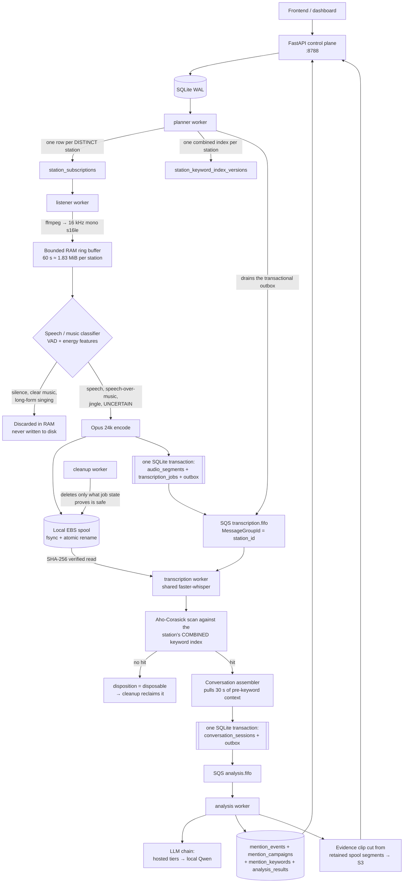

# Radio Broadcast Analysis

A self-hosted radio intelligence backend. It listens to live radio streams,
throws away music, transcribes speech with a multilingual model, matches
campaign keywords across languages and scripts, analyses each mention with an
LLM, cuts a playable evidence clip, and serves the result through a FastAPI
service that a web dashboard consumes.

The whole system runs on one EC2 instance as seven Docker Compose services.
Analysis runs on a **local** model by default; hosted LLM tiers are optional,
off unless configured, and always fall back to the local model.

| | |
|---|---|
| Version | `0.4.1` ([VERSION](VERSION)) |
| Language | Python ≥ 3.11 |
| API | FastAPI + uvicorn, port **8788** (the only published port) |
| Datastore | SQLite in WAL mode + S3 for durable results, evidence and backups |
| Queues | 2 × Amazon SQS **FIFO** (`transcription`, `analysis`) |
| ASR | faster-whisper / CTranslate2, `Systran/faster-whisper-small`, int8, CPU |
| Analysis LLM | Qwen3-0.6B-Q8 on llama.cpp `llama-server` (internal only), optional hosted tiers above it |
| Target host | AWS EC2 Graviton, aarch64, 8 vCPU / 16 GiB (`c7g`/`c8g.2xlarge` class) |
| Deployment | GitHub OIDC → fixed SSM document → immutable Compose release. No SSH, no port 22, no static AWS keys |
| Source of truth | `main` only |

---

## 1. The one pipeline

There is exactly one production processing architecture: **shared station +
SQS**. One stream connection per *distinct* station, whatever the campaign
count. The old `RADIO_PIPELINE_MODE` switch is gone — see
[ADR-single-shared-sqs-pipeline](docs/architecture/adr/ADR-single-shared-sqs-pipeline.md).



The queues carry **metadata and references only** — never audio bytes, never a
transcript body, never a credential or presigned URL. Audio lives on the local
spool while it is being worked on; durable results, evidence clips and backups
go to S3.

### Why it is economical

| Invariant | Why it matters |
|---|---|
| One listener per **distinct** station | 100 campaigns watching one station is one decode, not 100 |
| Never one listener per campaign | Campaign count stops driving CPU |
| Never one worker per keyword | 10,000 keywords is one scan, not 10,000 |
| Each segment transcribed **once** | ASR is the expensive step; paying twice halves capacity |
| One combined keyword index per station | Built once per station and index version, not per campaign |
| One conversation analysed **once** | The LLM runs once and its answer fans out |
| One mention maps to **many** campaigns and keywords | Attribution survives de-duplication |
| The LLM runs only **after** a keyword is confirmed | The model never sees audio nobody asked about |
| Every SQS consumer is idempotent | Redelivery is normal, not an incident |

---

## 2. Repository structure

```
Radio-Broadcast-Analysis/
├── app/                          # the application — one package, three runtimes
│   ├── main.py                   # FastAPI app + lifespan wiring (builds every service)
│   ├── __main__.py               # `python -m app` → uvicorn
│   ├── config.py                 # ONE Settings model (~200 vars), validated at start-up
│   ├── db.py                     # v0.3 core schema, WAL, retries, write boundary
│   ├── db_catalog.py             # v0.4 catalogue + managed-station schema
│   ├── models.py                 # API request/response models (brand-signal)
│   ├── models_catalog.py         # API models for catalogue + monitoring
│   ├── observability.py          # structured logging, trace_id contextvar
│   ├── text.py / s3_utils.py     # legacy normalisation, S3 key helpers
│   │
│   ├── api/
│   │   ├── routes.py             # health, campaigns, mentions, dashboard, audio, sync
│   │   └── catalog_routes.py     # radio catalogue, preview, capacity, monitoring
│   │
│   ├── cli/
│   │   ├── migrate_database.py   # `python -m app.cli.migrate_database` (deploy step)
│   │   └── validate_configuration.py  # config validated inside the built image
│   │
│   ├── migrations/
│   │   └── registry.py           # forward-only migrations 0003–0007
│   │
│   ├── pipeline/                 # the transport + reliability layer (no business logic)
│   │   ├── contracts.py          # versioned SQS message schemas, 64 KiB ceiling
│   │   ├── queue.py              # MessageQueue protocol + FIFO-faithful MemoryQueue
│   │   ├── sqs_queue.py          # boto3 SQS FIFO backend
│   │   ├── outbox.py             # transactional outbox + dispatcher
│   │   ├── idempotency.py        # consumer inbox + MessageProcessor loop
│   │   ├── heartbeat.py          # worker heartbeats, stale-job sweeper
│   │   ├── segment_store.py      # store protocol + SHA-256 verification
│   │   ├── local_segment_store.py# spool store: TOCTOU-safe, atomic writes
│   │   ├── s3_segment_store.py   # distributed / overflow store
│   │   ├── factory.py            # single place backends are chosen
│   │   ├── ids.py                # identifier validation, BLAKE2b shard hashing
│   │   ├── enums.py              # shared vocabulary (Literal aliases)
│   │   └── errors.py             # error taxonomy — retryable is a *type*, not a guess
│   │
│   ├── services/                 # the domain logic
│   │   ├── stream_supervisor.py  # one async ffmpeg session per distinct station
│   │   ├── ring_buffer.py        # bounded PCM buffer, sample-count timestamps
│   │   ├── audio_classifier.py   # VAD + energy speech/music policy (recall-first)
│   │   ├── segment_encoder.py    # PCM → Opus 24k (WAV fallback)
│   │   ├── subscription_planner.py # campaigns → station subscriptions + indexes
│   │   ├── station_url_resolver.py # station id → playable stream URL
│   │   ├── keyword_index.py      # combined per-station index, content-addressed
│   │   ├── keyword_matcher.py    # pure-Python Aho-Corasick, verbatim evidence
│   │   ├── text_normalization.py # script-aware Unicode normalisation
│   │   ├── transcription.py      # two-pass faster-whisper behind a protocol
│   │   ├── conversation_assembler.py # segments → physical conversations
│   │   ├── content_classifier.py # transcript → content type (ads, news, lyrics…)
│   │   ├── llm_analysis.py       # tiered LLM chain, schema, repair, fallback
│   │   ├── result_writer.py      # mention fan-out: SQLite first, S3 second
│   │   ├── evidence.py           # cut + upload the playable mention clip
│   │   ├── net_safety.py         # SSRF defence for untrusted stream URLs
│   │   ├── radio_browser.py      # Radio Browser mirror pool client
│   │   ├── catalog.py            # catalogue merged with the curated overlay
│   │   ├── monitoring.py         # capacity, admission, estimates, activation
│   │   ├── preview.py            # signed short-lived station preview proxy
│   │   ├── pipeline_status.py    # cheap health / readiness / capacity reporting
│   │   ├── campaigns.py, keywords.py, stations.py, sync.py
│   │   ├── analysis.py, conversation.py, llm.py, semantic.py, audio.py
│   │   └── ...
│   │
│   ├── workers/                  # the five worker processes
│   │   ├── __init__.py           # BaseWorker: loop, heartbeat, graceful SIGTERM
│   │   ├── planner.py            # subscriptions + keyword indexes + outbox dispatch
│   │   ├── listener.py           # capture → classify → spool → queue
│   │   ├── transcription.py      # ASR → match → conversation → queue
│   │   ├── analysis.py           # LLM → mention → evidence → S3
│   │   └── cleanup.py            # spool retention, bounded by job state
│   │
│   └── data/                     # bundled curated catalogue overlay (JSON)
│
├── docker/                       # three images + entrypoints + healthchecks
│   ├── api.Dockerfile            # lean API image (no ASR stack)
│   ├── pipeline.Dockerfile       # workers: ffmpeg, CTranslate2, faster-whisper
│   ├── llm.Dockerfile            # llama.cpp llama-server (pinned tag)
│   ├── entrypoints/{api,worker,llm}.sh
│   └── healthchecks/{api,worker}.py
│
├── compose.yaml                  # base stack, security posture, profiles
├── compose.dev.yaml              # ./var dirs, reload, no models, no AWS
├── compose.prod.yaml             # loopback bind, CPU/memory limits for the real host
│
├── deploy/
│   ├── cloudformation/github-oidc.yaml  # the OIDC role GitHub assumes
│   ├── env/application.env.example      # production config template
│   ├── dev/{application,infrastructure}.env  # committed dev placeholders
│   └── toolchain.lock.json              # pinned host toolchain
│
├── scripts/                      # deployment and operations (bash + stdlib python)
│   ├── main-auto-deploy.sh       # the ONLY automation surface SSM invokes
│   ├── deploy-compose.sh         # immutable release by commit + stage
│   ├── rollback-compose.sh       # code/images only — never the database
│   ├── ensure-host-prerequisites.sh, ensure-production-config.sh, ensure-models.sh
│   ├── migrate-db.sh, backup-sqlite.sh, cleanup-spool.sh
│   ├── smoke-test.sh, container-smoke-test.sh, compose-check.sh, secret-scan.sh
│   ├── benchmark-capacity.sh     # the harness that would justify raising capacity
│   └── download-models.py, verify-models.py
│
├── tests/                        # ~40 files: unit, integration, load, deployment
│   ├── unit/                     # per-module contracts (matcher, queue, ASR, LLM…)
│   ├── integration/              # end-to-end through the in-memory queue
│   ├── load/                     # `-m load`: the 1,000-station control-plane proof
│   └── fixtures/                 # synthetic audio and campaign builders
│
├── docs/                         # architecture, ADRs, capacity, ops, quality
├── tools/build_radio_database_overlay.py
├── models.lock.json              # pinned model files + digests
├── Makefile                      # `make help` lists every entry point
└── .github/workflows/            # ci, codeql, deploy-main, oidc-ssm-smoke
```

---

## 3. The seven runtime services

| Compose service | Process | Role |
|---|---|---|
| `api` | uvicorn | FastAPI control plane on **8788** — the only published port. Applies migrations in its lifespan |
| `planner` | `app.workers.planner` | Campaigns → one subscription per distinct station, publishes combined keyword indexes, **drains the outbox to SQS**, sweeps stale job leases |
| `listener` | `app.workers.listener` | One async ffmpeg session per distinct active station → ring buffer → classifier → spool + queue |
| `transcription-worker` | `app.workers.transcription` | Shared faster-whisper; ASR → keyword match → conversation assembly → analysis queue |
| `analysis-worker` | `app.workers.analysis` | LLM analysis, mention fan-out, S3 publication, evidence clips, backlog healing |
| `cleanup-worker` | `app.workers.cleanup` | Spool reclamation bounded by SQLite job state; table pruning |
| `llm` | llama.cpp `llama-server` | Qwen3-0.6B-Q8 on internal port 8790. **Never published** |

Every container runs non-root with all capabilities dropped,
`no-new-privileges`, a read-only root filesystem, an explicit tmpfs, a pids
limit and rotated logs. Models are mounted read-only and are **never** downloaded
at container start-up.

**Compose profiles** select a subset without editing a file: `core`
(api + planner), `pipeline` (listener + workers), `llm`, `integration` (all).

**Deployment stages** `api`, `core` and `full` are *rollout stages, not pipeline
alternatives*. They exist so a host is widened one step at a time; `full` always
runs the one shared-SQS architecture.

---

## 4. The flow, stage by stage

### Stage 0 — Intent (API)

A campaign is created through `POST /api/v1/brand-signal/campaigns` with
keywords, aliases, a content policy and either explicit station ids or a
`station_selection` (explicit / country_top / country_all). The API records
intent and nothing else — it never starts a stream.

Stations come from the [Radio Browser](https://api.radio-browser.info)
community catalogue, merged with a bundled curated override/deletion overlay.
Public responses **never** contain a stream URL; the browser deals in station
UUIDs and short-lived preview tokens.

### Stage 1 — Planning (`planner`)

Every `RADIO_PLANNER_POLL_SECONDS` (5 s default) the planner:

1. reads active campaigns and groups keyword bindings by **distinct** station;
2. upserts one `station_subscriptions` row per station with a reference count —
   `0→1` creates, `1→N` reuses (nothing restarts), `1→0` arms a wind-down timer;
3. resolves a stream URL for stations that lack one (durable first, Radio
   Browser second, bounded per cycle, with backoff — `/json/url` counts a click);
4. builds the **combined keyword index** for the station and publishes a new
   version only when the *effective* content fingerprint changed;
5. admits stations up to `RADIO_MAX_ACTIVE_UNIQUE_STATIONS`; the rest are parked
   as `pending_capacity` — a queue with a stated reason, never a silent drop;
6. drains the transactional outbox to SQS and sweeps stale job leases.

Shard assignment uses BLAKE2b, never Python's `hash()` — which is randomised per
process and would split-brain two listener containers.

### Stage 2 — Capture (`listener`)

One async session per distinct assigned station:

* ffmpeg decodes whatever the station serves (MP3, AAC, HLS, Ogg) into 16 kHz
  mono s16le. ffmpeg's own `-reconnect` is deliberately **off** so every
  reconnect re-runs the SSRF check; `-protocol_whitelist` excludes `file` and
  `concat`;
* PCM lands in a fixed-size ring buffer (60 s ≈ **1.83 MiB per station**, allocated
  once). Timestamps come from the sample count, not `datetime.now()`;
* a rolling classifier scores each window and the session emits ~20 s segments
  with 1 s overlap, closing on sustained silence (12 s) or sustained music.

For each retained segment, in order: **encode → write bytes (fsync + atomic
rename) → one SQLite transaction** inserting the `audio_segments` row, the
`transcription_jobs` row *and* the outbox event. Bytes land before anything
references them, and the reference plus the intent-to-send commit together — so
there is no window where a job exists without its audio, and none where a
durable segment is never queued ([ADR-009](docs/architecture/adr/ADR-009-idempotency-and-outbox.md)).

Disk watermarks are checked **before** admitting a segment: 70 % warns, 85 %
stops admitting, 90 % is an emergency that also stops every session.

### Stage 3 — Transcription and matching (`transcription-worker`)

For each message on `transcription.fifo`:

1. skip and acknowledge jobs older than `RADIO_TRANSCRIPTION_MAX_AGE_HOURS`
   (6 h) — monitoring is about *now*, and decoding a day-old backlog starves
   the fresh audio behind it;
2. read the segment from the store, **verifying the SHA-256 recorded at write
   time** before the bytes reach a decoder;
3. run pass-A ASR (greedy, `beam_size=1`, auto language detection) — tuned for
   throughput and recall;
4. scan the transcript **once** against the station's combined index with a
   pure-Python Aho-Corasick automaton, cached per `(station, index version)`.
   O(len(text)) regardless of keyword count. Each hit resolves to every campaign
   that registered it;
5. fold the result into that station's conversation assembler;
6. when a conversation closes with keyword evidence, commit it and enqueue
   **exactly one** analysis job.

`MessageGroupId = station_id` is what makes step 5 sound: SQS FIFO delivers one
message per group at a time, so a station's segments arrive in order and one
assembler per station is enough. The assembler does not *trust* that — duplicates
are ignored, out-of-order arrivals rejected, sequence gaps recorded (gaps are
normal: discarded music consumes no sequence number).

A conversation reaches **backwards** by `RADIO_PRE_KEYWORD_SECONDS` (30 s),
because the sentence that introduces a brand rarely contains it, and closes on
one of: `silence`, `music`, `max_duration`, `disconnect`, `shutdown`, `error`.

### Stage 4 — Analysis (`analysis-worker`)

One message is one conversation, so the model runs **exactly once per mention**
no matter how many campaigns it maps to. The transcript is reloaded from SQLite
rather than carried in the message — transcripts travel by reference
([ADR-003](docs/architecture/adr/ADR-003-sqs-fifo-message-contracts.md)).

The worker then:

1. classifies the transcript's content type (advertisement, news, interview,
   announcement, song lyrics, …) from lexical cues, audio class, duration and
   lexical repetition;
2. calls the LLM chain (§6) for a validated JSON analysis;
3. persists **one** `mention_events` row plus **many** mapping rows — one
   `mention_campaigns` per campaign, one `mention_keywords` per keyword — in one
   transaction that also writes the consumer inbox row;
4. publishes the document to S3 (allowed to fail; SQLite is the system of record);
5. cuts an evidence clip from the retained spool segments and uploads it to
   `evidence/YYYY/MM/DD/<mention_id>.<ext>`, which flips `audio_available` on
   every mention view.

Analysis **never fails a message**. A wedged model produces a thinner mention
via the deterministic fallback, not a poison message. During idle ticks the
worker sweeps two backlogs: mentions with no clip (which also backfills mentions
created before evidence capture existed), and mentions whose analysis fell back
during an outage — those are re-run and replaced once the model answers again.

`mention_events` deliberately has **no** `campaign_id` and **no** `keyword_id`
column. Attribution lives only in the mapping tables, which makes "transcribe
once, analyse once, attribute many times" true by construction.

### Stage 5 — Retention (`cleanup-worker`)

Deleting audio is the one irreversible thing this system does, so **a file is
removed only when SQLite says it is safe.** Age alone is never sufficient — a
segment can be minutes old and still queued behind a slow worker.

| Disposition | Policy |
|---|---|
| `pending` | not yet transcribed — **never deleted, at any watermark** |
| `retained` | part of a mention — **never deleted here** |
| `disposable` | transcribed, matched nothing, past `RADIO_NO_HIT_RETENTION_MINUTES` (10) |
| `failed` | past `RADIO_FAILED_SEGMENT_RETENTION_HOURS` (24), kept longer for diagnosis |

Watermarks escalate rather than switch. Even at emergency the worker would
rather report a full disk than delete evidence. `--once --dry-run` reports what
*would* be reclaimed, using the same predicates — there is exactly one
implementation of "safe to delete".

---

## 5. Reliability model

| Mechanism | What it prevents |
|---|---|
| **Transactional outbox** | A crash after the business commit leaving work that is never queued — a *silent stall*. Producers never call SQS; the planner dispatches |
| **Consumer inbox** | A redelivery becoming a second mention. Business result + inbox row commit together, *then* the message is deleted. SQS FIFO dedup is 5 minutes and is defence in depth only |
| **UNIQUE constraints** | Every business insert is guarded by one rather than a prior `SELECT`, so redoing work converges instead of duplicating |
| **Visibility heartbeats** | A long ASR decode losing its message mid-flight (300 s visibility, extended every 60 s, hard stop at 1800 s) |
| **Worker heartbeats** | `/readyz` telling "no listener has ever run" apart from "the listener died four minutes ago" |
| **Stale-job sweeper** | A job stuck in `running` forever because its worker was killed after `ReceiveMessage` |
| **Error taxonomy** | Retryability is a property of the exception type, not a decision re-made at each call site. Non-retryable → recorded in `processing_failures`, inbox row written, message deleted |
| **Graceful SIGTERM** | The signal sets an event; the loop finishes its current unit of work. Open conversations are flushed on shutdown |
| **Digest verification** | Corrupt or tampered audio failing closed instead of being laundered into the evidence record |

Message contracts ([`app/pipeline/contracts.py`](app/pipeline/contracts.py)) are
versioned Pydantic models with a self-imposed **64 KiB** ceiling (~16× below the
SQS limit), an explicit schema allowlist, and a rule that nothing which could be
a secret, a credential, a presigned URL or audio bytes may appear in a message.

`MemoryQueue` is **not a stub**: it reproduces per-group ordering, at-most-one
in-flight message per group, the 5-minute dedup window, visibility timeouts and
receive counts. The contract tests run against both backends, so a divergence
shows up as a test failure rather than in production.

---

## 6. Analysis: the LLM tier chain

The model sits **after** a keyword match, never before, and runs exactly once
per conversation. The matcher decides that a mention exists; the model only
explains one that already exists. An analysis that says "this is about NVIDIA"
for a conversation the matcher found nothing in produces **no mention at all**.

Default deployment is local-only. Each enabled hosted tier stacks above the
local model in fixed priority order:

```
NVIDIA → Ollama cloud → Groq → Mistral → Gemini → local llama-server
```

* any error, or a 200 whose body carries no parseable JSON, **cascades to the
  next tier within the same call**;
* the failed tier rests for `RADIO_LLM_REMOTE_RETRY_SECONDS` (default 2 hours).
  Cooldowns are per tier, so one dead provider never hides a healthy one;
* the local model is the end of the chain and needs no cooldown;
* per-tier `*_EXTRA_BODY` JSON is the operator's escape hatch for provider knobs
  (reasoning toggles above all). A provider that rejects a field answers with a
  named HTTP error and the chain cascades, so experimenting is safe;
* every tier is enabled explicitly and refuses to start without its API key.

**Model output is untrusted input.** Every field is validated:

* evidence text must occur **verbatim in the transcript** — a quoted phrase that
  was never broadcast is the worst failure this system could have;
* evidence timestamps must fall inside the conversation;
* enumerations must be members of their declared sets; unknown fields rejected;
* confidence is clamped into `[0,1]` (a model answering `70` is read as `0.70`);
* over-length strings **truncate** rather than fail — a rambling model has still
  found the mention, and failing would replace a real analysis with the fallback.

Invalid output gets one bounded repair attempt, then the deterministic fallback.
Reasoning traces are never stored or returned: non-thinking mode is requested
where supported and any `<think>` block that arrives anyway is stripped before
parsing. A circuit breaker converts a queue of timing-out calls into fast, cheap
fallbacks until the model recovers.

Locally the request is grammar-constrained: llama.cpp compiles the response
JSON schema into GBNF, so malformed JSON is impossible at decode time. (The
schema carries **no** `maxLength` anywhere — llama.cpp compiles string bounds
into grammar repetitions large enough to fail its own parser. Length limits live
in the Pydantic model instead.)

---

## 7. Audio policy

Deliberately conservative, because a missed mention is invisible and a wasted
transcription is only CPU.

| Content | Kept? |
|---|---|
| Clear silence | discarded |
| Clear instrumental music | discarded |
| Clear long-form singing | discarded by default |
| Speech | transcribed |
| **Speech over a music bed** | **transcribed** — this is what most radio advertising sounds like |
| Spoken advertisement | transcribed |
| Sung advertising jingle | transcribed by default |
| Announcement, emergency alert | transcribed |
| Uncertain | **transcribed**, to protect recall |

The classifier combines `low_energy_ratio`, `zcr_variance`, `energy_variance`,
`silence_ratio` and — when the ONNX model is present — Silero VAD, treated as
one vote and never as the answer. Nothing is discarded on a single frame or
window; discard requires the same confident verdict sustained for
`RADIO_PURE_MUSIC_DISCARD_SECONDS`.

Every threshold is a **provisional starting point, not a measured optimum**.
It is not a perfect singing detector and is not described as one — uncertain
audio is transcribed precisely because the classifier can be wrong. Precision is
recovered later, from the transcript, where the evidence is inspectable.

---

## 8. Multilingual matching

Keywords match across scripts with:

* **script-aware normalisation** — NFKD + mark-stripping is right for Latin and
  wrong for Devanagari (removing a matra changes the word), so mark-significant
  scripts keep their combining marks while Arabic/Hebrew diacritics are folded;
* **script-aware word boundaries** — CJK, Thai, Lao, Khmer and Myanmar have no
  spaces, so `\b` is meaningless and normalised substring matching is used;
* **per-language aliases**, including Romanised forms;
* **match levels**: `exact` / `alias` / `transliteration` are confirmed directly;
  `fuzzy` / `phonetic` / `semantic` are *candidates* flagged
  `requires_confirmation`. Translated equivalents are refused outright for
  brands, people, products and organisations — "Apple" the company is not
  "सेब" the fruit.

  **The confirming second decode is not wired up.**
  [`TranscriptionService.confirm()`](app/services/transcription.py#L574) — wide
  beam, word timestamps, keyword-primed prompt — exists and is unit-tested, but
  no worker calls it. No transcript row is ever written with `asr_pass='b'`, so
  a candidate match is persisted with its flag set and nothing ever re-decodes
  it. Treat the design intent in
  [`keyword_matcher.py`](app/services/keyword_matcher.py) as a plan, not as
  running behaviour.

Evidence is always a **verbatim substring of the transcript**, recovered through
an offset map, never a translation and never normalised text.

Quality depends on the ASR model's accuracy for the language and on the aliases
configured. **No claim is made of perfect support for any language** — see
[docs/QUALITY_EVALUATION.md](docs/QUALITY_EVALUATION.md), which states plainly
that nothing has yet been evaluated against labelled broadcast audio.

---

## 9. Capacity: four different numbers

Conflating these is the easiest way to misread this system.

| Number | Value | What it is |
|---|---|---|
| Catalogue stations | 1,000+ | Rows you can browse and search |
| **Requested** unique stations | 1,000 | Distinct stations campaigns may ask for. A control-plane number: rows, mappings, keyword indexes. Proven by `pytest -m load` |
| **Active** unique stations | **1** by code default | Stations decoded *right now*. One ffmpeg decode, one ring buffer, a share of ASR each |
| Real-time ASR capacity | **unmeasured** | How many streams this host can transcribe faster than real time. **No benchmark has been run** |

Requesting more stations than the active limit is accepted and recorded; the
overflow is parked as `pending_capacity` — a **queue, not a refusal** — and each
parked station records why. Slots are taken as they free.

The code default for `RADIO_MAX_ACTIVE_UNIQUE_STATIONS` is `1`, the only figure
this deployment has been verified for. The production template
([deploy/env/application.env.example](deploy/env/application.env.example)) sets
it to `512` together with `RADIO_ALLOW_UNBENCHMARKED_CAPACITY=1` — the owner's
explicit, in-writing acceptance that running above the benchmarked ceiling is
unmeasured. The hard configuration ceiling is 512.

**This deployment does not support 1,000 simultaneous live streams**, and
nothing here should be read as claiming it does — nor that 512 do.
[docs/CAPACITY.md](docs/CAPACITY.md) describes the benchmark harness
([scripts/benchmark-capacity.sh](scripts/benchmark-capacity.sh)) that would
justify a number.

---

## 10. HTTP API

`GET /docs` serves Swagger UI. The pilot host is intentionally unauthenticated
(`auth_mode: none`) and reachable only from the CIDR its security group allows.

| Group | Endpoints |
|---|---|
| Health | `GET /healthz` (database, S3, LLM, pipeline), `GET /readyz` (SQLite + one statvfs only; 503 when not ready) |
| Campaigns | `GET/POST /api/v1/brand-signal/campaigns`, `GET/PATCH/DELETE /{id}`, `POST /{id}/start`, `POST /{id}/stop` |
| Mentions | `GET /mentions`, `GET /mentions/{id}/detail`, `POST /mentions/{id}/analysis` |
| Dashboard | `GET /dashboard` (campaigns + mentions + sentiment over `RADIO_MENTION_WINDOW_DAYS`) |
| Audio | `POST /mentions/{id}/audio-token`, `GET /audio/{token}` (HMAC token, TTL, Range support) |
| Stations | `GET /brand-signal/stations`, `POST /brand-signal/sync`, `GET /brand-signal/runtime` |
| Catalogue | `GET /api/v1/radio-catalog/{countries,languages,tags,codecs,stations}`, `GET /stations/{uuid}` |
| Preview | `POST /radio-catalog/stations/{uuid}/preview-token`, `GET /radio-catalog/preview/{token}` |
| Monitoring | `GET /api/v1/monitoring/{pipeline,capacity,stations,jobs}`, `POST /stations/estimate`, `POST /stations/{uuid}/activate`, `POST /stations/{id}/stop`, `GET /stations/{id}/{status,probe-result}` |

Health endpoints are cheap by construction — SQLite reads and one `statvfs`.
A readiness probe that does network I/O fails under exactly the load it exists
to detect.

---

## 11. Data model

One SQLite file in WAL mode, four pragmas on every connection, forward-only
migrations ([ADR-004](docs/architecture/adr/ADR-004-sqlite-wal-and-write-boundaries.md)).

| Layer | Tables |
|---|---|
| Campaigns (v0.3) | `campaigns`, `campaign_keywords`, `campaign_stations`, `campaign_content_policies`, `campaign_keyword_aliases`, `mentions`, `mention_analysis`, `sync_objects`, `semantic_scan_objects` |
| Catalogue (v0.4) | `radio_catalog_overrides`, `radio_catalog_deletions`, `managed_stations`, `campaign_station_members`, `campaign_station_rules`, `station_jobs`, `station_probe_results`, `capacity_snapshots`, `preview_audit` |
| Planner | `station_subscriptions`, `station_keyword_index_versions`, `station_keyword_bindings` |
| Capture & ASR | `station_sessions`, `audio_segments`, `transcription_jobs`, `transcripts` |
| Analysis | `conversation_sessions`, `mention_events`, `mention_campaigns`, `mention_keywords`, `analysis_jobs`, `analysis_results` |
| Reliability | `outbox_events`, `inbox_messages`, `worker_heartbeats`, `processing_failures`, `schema_migrations` |

S3 holds the durable exports: results, conversation analyses, transcripts,
mentions, evidence clips and backups, each under its own configured prefix.

---

## 12. Configuration

One Pydantic-settings model — [`app/config.py`](app/config.py) — is the single
source of truth for ~200 environment variables. Everything is validated at
start-up, with enumerations declared as `Literal` so a typo is rejected rather
than silently selecting a no-op path. Cross-field coherence is checked too
(pre-roll must fit the ring buffer, heartbeat must be shorter than visibility,
spool watermarks must be strictly ordered, a shard index must be inside its
shard count, …).

Three refusals worth knowing about:

1. **Production refuses test doubles.** `APP_ENV=production` requires
   `RADIO_QUEUE_BACKEND=sqs` and the real ASR backend. The memory queue loses
   every message on restart and the fake engines return fixed strings — the
   system would look healthy while producing nothing.
2. **Removed settings fail loudly.** `RADIO_PIPELINE_MODE`,
   `RADIO_MAX_ACTIVE_STATIONS` and `RADIO_RECONCILER_POLL_SECONDS` no longer
   exist; a stale environment file naming them refuses to boot rather than being
   silently ignored.
3. **Queue URLs must be FIFO.** An `https` URL whose path does not end in
   `.fifo` is rejected — per-station ordering is a correctness requirement.

Configuration is split into two files on the host, both git-ignored and
`.dockerignore`d:

| File | Contents |
|---|---|
| `/etc/radio-broadcast-analysis/infrastructure.env` | Account-specific: region, bucket, queue URLs |
| `/etc/radio-broadcast-analysis/application.env` | Behaviour, capacity, model and LLM settings, the audio-token secret |

[.env.example](.env.example) documents every variable with the reasoning behind
its default. AWS credentials never appear in either file — the EC2 instance role
supplies them.

---

## 13. Deployment

`main` is the only deployment source. A reviewed change lands on main, every
protected check passes on that exact commit, and the commit deploys itself:

1. GitHub authenticates to AWS with **OIDC** — no static credentials, no EC2 key
   pair, no port 22.
2. It sends one 40-character commit SHA to the fixed SSM document
   `RadioBroadcastDeployMain` at a pinned version. There is no input through
   which an arbitrary command can be sent.
3. The host fetches only that commit, verifies it is an ancestor of
   `origin/main`, and runs **the release's own scripts**.

On the host, [`scripts/main-auto-deploy.sh`](scripts/main-auto-deploy.sh) is the
entire automation surface: it accepts exactly two arguments and decides
everything else from the repository content at that commit. It ensures the host
toolchain, creates missing production configuration **once** (never regenerating
a secret), verifies the pinned models, builds the images, runs migrations in a
one-shot container, brings the stage up and smoke-tests it.

Release directories are immutable and identified by **commit + stage**. Rollback
restores existing artifacts and never rebuilds, never pulls, and **never
restores the database** — reverting a SQLite file would discard every mention
written since the backup, and the schema is forward-only. A backup *is* taken
before rollback.

```bash
make deploy-dry-run COMMIT=<40-hex-sha> STAGE=core   # validate, build nothing
make rollback-dry-run                                # validate a rollback
make smoke                                           # post-deploy assertions
```

See [docs/DOCKER_DEPLOYMENT.md](docs/DOCKER_DEPLOYMENT.md) for the full sequence
and [docs/OPERATIONS.md](docs/OPERATIONS.md) for day-two operations.

---

## 14. Development

```bash
python -m pip install -r requirements.txt -r requirements-dev.txt
cp .env.example .env          # then fill in RADIO_S3_BUCKET and the token secret

make test                     # deterministic suite: no AWS, no models
make test-unit                # per-module contracts
make test-integration         # end-to-end through the in-memory queue
make test-load                # `-m load`: the 1,000-station control-plane proof
make lint                     # ruff (E, F, I, B, UP; line length 120)
make compose-check            # resolve and audit the Compose security posture
make secret-scan              # fail if a credential looks committed
make check                    # everything CI runs
```

Run the stack locally with no models, no AWS and a fake ASR engine:

```bash
make dev-dirs && make dev-up          # ./var/* host dirs, env from ./deploy/dev
make dev-logs
```

Models are explicit, never automatic (~1.1 GB):

```bash
make models-plan      # show what would be fetched
make models           # download the pinned files
make models-verify    # verify against models.lock.json
```

The suite runs against the in-memory queue and fake ASR/LLM engines. Those are
**test doubles, not a second pipeline**: production is barred from both by
`APP_ENV=production`. `make help` lists every target.

CI runs ruff plus the suite on Python 3.11 and 3.12, with CodeQL on a schedule.

---

## 15. Security posture

* **No inbound SSH, no port 22, no EC2 key pair, no static AWS credentials.**
* Only port 8788 is published, bound to loopback by default in production;
  TLS termination and authentication belong in a reverse proxy.
* The inference endpoint is `expose`d on the Compose network only — an
  unauthenticated LLM on a host port is a serious liability.
* **SSRF defence** on every untrusted stream URL, revalidated per connection and
  per redirect hop (DNS can be re-pointed between validation and use). Anything
  that cannot be proven to resolve to a global unicast address is refused.
* Subprocesses are spawned with explicit argument arrays; `shell=True` never
  appears; the two configurable values that reach `argv` are pattern-validated.
* Path handling is TOCTOU-safe: identifiers are validated before a path is
  built, the resolved path must stay inside the spool root, `O_NOFOLLOW` is used
  where available, and `st_dev`/`st_ino` are compared after open.
* Logs carry **ids, not bodies** — never a transcript, a message body or a
  stream URL unless `RADIO_LOG_TRANSCRIPT_BODIES` is set explicitly.
* Every container: non-root, `cap_drop: ALL`, `no-new-privileges`, read-only
  root filesystem, pids limit, rotated logs. Never privileged, never host
  networking, never the Docker socket.

---

## 16. Known limits, stated plainly

* **Real-time ASR throughput is unmeasured.** The active-station limit is a
  configuration choice, not a benchmark result.
* **No language has been quality-evaluated.** Classifier thresholds and content
  cues are provisional; English, Hindi and Marathi cues are seeded, other
  languages fall through to `unknown` (which every campaign includes, by design).
* **SQLite is the honest answer only to about a hundred stations.** Past that,
  [ADR-004](docs/architecture/adr/ADR-004-sqlite-wal-and-write-boundaries.md)
  says PostgreSQL.
* **Per-group FIFO serialises a station's segments** across the whole fleet —
  a real throughput ceiling, chosen deliberately for ordering
  ([ADR-003](docs/architecture/adr/ADR-003-sqs-fifo-message-contracts.md)).
* **YAMNet-class audio classification is declared but not deployed** — its
  TensorFlow dependency is not practical on this target, so the backend refuses
  to start rather than silently substituting something else
  ([ADR-005](docs/architecture/adr/ADR-005-audio-classification-policy.md)).
* **ASR pass B is never invoked** (§8) — candidate matches are flagged but never
  re-decoded.
* **The S3 publish backlog is not a recovery path yet.**
  [`_publish_backlog`](app/workers/analysis.py#L479) selects mentions with a
  `NULL` `result_s3_key` and only logs the count; it never re-publishes them.
  Evidence capture *is* retried properly by its own idle sweep.
* **Nothing writes `campaign_content_policies`.** Two code paths read it
  ([subscription_planner.py:128](app/services/subscription_planner.py#L128),
  [analysis.py:289](app/workers/analysis.py#L289)) and the migration creates it,
  but no writer exists — so every campaign falls back to
  `Settings.content_policy_defaults`.
* **Two settings are dead.** `RADIO_TEMP_TRANSCRIPTS_PREFIX` and
  `RADIO_PIPELINE_CONFIG_PREFIX` are declared and validated in
  [config.py](app/config.py) but have no reader and no writer anywhere.

---

## 17. Documentation

| Document | Contents |
|---|---|
| [ADR-single-shared-sqs-pipeline](docs/architecture/adr/ADR-single-shared-sqs-pipeline.md) | Why there is one pipeline |
| [docs/architecture/adr/](docs/architecture/adr/) | Ten further decision records, each with alternatives, consequences and a reversal strategy |
| [docs/architecture/TARGET_ARCHITECTURE.md](docs/architecture/TARGET_ARCHITECTURE.md) | The data path in detail |
| [docs/architecture/diagrams/aws-architecture.drawio](docs/architecture/diagrams/aws-architecture.drawio) | **Three-page draw.io diagram**: the AWS architecture with the EC2 internals, the 22-step numbered backend pipeline, and the CI/CD chain. Regenerate with [`generate_aws_architecture.py`](docs/architecture/diagrams/generate_aws_architecture.py) — edit the script, not the XML |
| [docs/architecture/diagrams/pipeline-flow.puml](docs/architecture/diagrams/pipeline-flow.puml) | Campaign-to-mention diagram (PlantUML + AWS icons) |
| [docs/DOCKER_DEPLOYMENT.md](docs/DOCKER_DEPLOYMENT.md) | Deployment, stages, rollback, failure semantics |
| [docs/OPERATIONS.md](docs/OPERATIONS.md) | Daily checks, alerts, backups, deliberate limits |
| [docs/CAPACITY.md](docs/CAPACITY.md) | The four capacity numbers and the benchmark harness |
| [docs/MODEL_MANAGEMENT.md](docs/MODEL_MANAGEMENT.md) | Pinned models, digests, installation |
| [docs/QUALITY_EVALUATION.md](docs/QUALITY_EVALUATION.md) | Transcription and matching quality — and what is not yet measured |
| [docs/research/TECHNOLOGY_RESEARCH.md](docs/research/TECHNOLOGY_RESEARCH.md) | Verified versions, wheels and quotas, from primary sources |
| [RELEASE_NOTES.md](RELEASE_NOTES.md) · [THIRD_PARTY.md](THIRD_PARTY.md) | Release history and third-party attribution |
